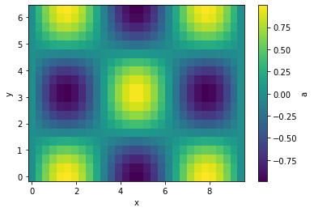

# Dragoman


> A dragoman was an interpreter, translator, and official guide between Turkish, Arabic, and Persian-speaking countries and polities of the Middle East and European embassies, consulates, vice-consulates and trading posts. A dragoman had to have a knowledge of Arabic, Persian, Turkish, and European languages. (Source: wikipedia)

Similarly, the dragoman python library guides you through your data and translates between different representations.
Its aim is to offer a consistant and pythonic way to handle different datasaets and translations between them.
A dataset can for instance be simple colum/row data, or it can be data on a grid.

One of the key features of dragoman is the seamless translation from one data represenation into any other. 
Convenience `pyplot` plotting functions are also available, in order to produce standard plots without any hassle.

## Installation

* `git clone git@github.com:philippeller/dragoman.git`
* `pip install dragoman`

## Simple Examples

### Grid Data


```python
import numpy as np
import dragoman as dm
```


```python
g = dm.GridData(x = np.linspace(0,3*np.pi, 30),
                y = np.linspace(0,2*np.pi, 20),
               )
```


```python
g['a'] = np.sin(g['x']) * np.cos(g['y'])
```


```python
g
```


<table>
<tbody>
<tr><td><b>y \ x</b></td><td><b>0</b></td><td><b>0.325</b></td><td><b>0.65</b></td><td><b>0.975</b></td><td><b>1.3</b> </td><td><b>1.62</b></td><td>...</td><td><b>7.8</b> </td><td><b>8.12</b></td><td><b>8.45</b></td><td><b>8.77</b></td><td><b>9.1</b> </td><td><b>9.42</b>  </td></tr>
<tr><td><b>0</b>    </td><td>a = 0   </td><td>a = 0.319   </td><td>a = 0.605  </td><td>a = 0.828   </td><td>a = 0.964  </td><td>a = 0.999  </td><td>...</td><td>a = 0.999  </td><td>a = 0.964  </td><td>a = 0.828  </td><td>a = 0.605  </td><td>a = 0.319  </td><td>a = 3.67e-16 </td></tr>
<tr><td><b>0.331</b></td><td>a = 0   </td><td>a = 0.302   </td><td>a = 0.572  </td><td>a = 0.783   </td><td>a = 0.911  </td><td>a = 0.944  </td><td>...</td><td>a = 0.944  </td><td>a = 0.911  </td><td>a = 0.783  </td><td>a = 0.572  </td><td>a = 0.302  </td><td>a = 3.47e-16 </td></tr>
<tr><td><b>0.661</b></td><td>a = 0   </td><td>a = 0.252   </td><td>a = 0.478  </td><td>a = 0.653   </td><td>a = 0.76   </td><td>a = 0.788  </td><td>...</td><td>a = 0.788  </td><td>a = 0.76   </td><td>a = 0.653  </td><td>a = 0.478  </td><td>a = 0.252  </td><td>a = 2.9e-16  </td></tr>
<tr><td><b>0.992</b></td><td>a = 0   </td><td>a = 0.175   </td><td>a = 0.331  </td><td>a = 0.453   </td><td>a = 0.527  </td><td>a = 0.546  </td><td>...</td><td>a = 0.546  </td><td>a = 0.527  </td><td>a = 0.453  </td><td>a = 0.331  </td><td>a = 0.175  </td><td>a = 2.01e-16 </td></tr>
<tr><td><b>1.32</b> </td><td>a = 0   </td><td>a = 0.0784  </td><td>a = 0.149  </td><td>a = 0.203   </td><td>a = 0.237  </td><td>a = 0.245  </td><td>...</td><td>a = 0.245  </td><td>a = 0.237  </td><td>a = 0.203  </td><td>a = 0.149  </td><td>a = 0.0784 </td><td>a = 9.02e-17 </td></tr>
<tr><td><b>1.65</b> </td><td>a = -0  </td><td>a = -0.0264 </td><td>a = -0.05  </td><td>a = -0.0684 </td><td>a = -0.0796</td><td>a = -0.0825</td><td>...</td><td>a = -0.0825</td><td>a = -0.0796</td><td>a = -0.0684</td><td>a = -0.05  </td><td>a = -0.0264</td><td>a = -3.03e-17</td></tr>
<tr><td>...         </td><td>...     </td><td>...         </td><td>...        </td><td>...         </td><td>...        </td><td>...        </td><td>...</td><td>...        </td><td>...        </td><td>...        </td><td>...        </td><td>...        </td><td>...          </td></tr>
<tr><td><b>4.63</b> </td><td>a = -0  </td><td>a = -0.0264 </td><td>a = -0.05  </td><td>a = -0.0684 </td><td>a = -0.0796</td><td>a = -0.0825</td><td>...</td><td>a = -0.0825</td><td>a = -0.0796</td><td>a = -0.0684</td><td>a = -0.05  </td><td>a = -0.0264</td><td>a = -3.03e-17</td></tr>
<tr><td><b>4.96</b> </td><td>a = 0   </td><td>a = 0.0784  </td><td>a = 0.149  </td><td>a = 0.203   </td><td>a = 0.237  </td><td>a = 0.245  </td><td>...</td><td>a = 0.245  </td><td>a = 0.237  </td><td>a = 0.203  </td><td>a = 0.149  </td><td>a = 0.0784 </td><td>a = 9.02e-17 </td></tr>
<tr><td><b>5.29</b> </td><td>a = 0   </td><td>a = 0.175   </td><td>a = 0.331  </td><td>a = 0.453   </td><td>a = 0.527  </td><td>a = 0.546  </td><td>...</td><td>a = 0.546  </td><td>a = 0.527  </td><td>a = 0.453  </td><td>a = 0.331  </td><td>a = 0.175  </td><td>a = 2.01e-16 </td></tr>
<tr><td><b>5.62</b> </td><td>a = 0   </td><td>a = 0.252   </td><td>a = 0.478  </td><td>a = 0.653   </td><td>a = 0.76   </td><td>a = 0.788  </td><td>...</td><td>a = 0.788  </td><td>a = 0.76   </td><td>a = 0.653  </td><td>a = 0.478  </td><td>a = 0.252  </td><td>a = 2.9e-16  </td></tr>
<tr><td><b>5.95</b> </td><td>a = 0   </td><td>a = 0.302   </td><td>a = 0.572  </td><td>a = 0.783   </td><td>a = 0.911  </td><td>a = 0.944  </td><td>...</td><td>a = 0.944  </td><td>a = 0.911  </td><td>a = 0.783  </td><td>a = 0.572  </td><td>a = 0.302  </td><td>a = 3.47e-16 </td></tr>
<tr><td><b>6.28</b> </td><td>a = 0   </td><td>a = 0.319   </td><td>a = 0.605  </td><td>a = 0.828   </td><td>a = 0.964  </td><td>a = 0.999  </td><td>...</td><td>a = 0.999  </td><td>a = 0.964  </td><td>a = 0.828  </td><td>a = 0.605  </td><td>a = 0.319  </td><td>a = 3.67e-16 </td></tr>
</tbody>
</table>


```python
g.plot(cbar=True)
```


    <matplotlib.collections.QuadMesh at 0x7f1e405ab410>


```python
g.interp(x=200, y=200).plot(cbar=True)
```


    <matplotlib.collections.QuadMesh at 0x7f1e4806c410>


```python
g.
```


```python
np.sum(g[10::-1, :np.pi:2].T, axis='x')
```


<table>
<tbody>
<tr><td><b>y</b></td><td><b>0</b></td><td><b>0.661</b></td><td><b>1.32</b></td><td><b>1.98</b></td><td><b>2.65</b></td></tr>
<tr><td><b>a</b></td><td>6.03    </td><td>4.76        </td><td>1.48       </td><td>-2.42      </td><td>-5.3       </td></tr>
</tbody>
</table>


Alternative way without using Dragoman could look something like that


```python
x = np.linspace(0,3*np.pi, 20)
y = np.linspace(0,2*np.pi, 10) 

xx, yy = np.meshgrid(x, y)

a = np.sin(xx) * np.cos(yy)

import matplotlib.pyplot as plt

x_widths = np.diff(x)
x_pixel_boundaries = np.concatenate([[x[0] - 0.5*x_widths[0]], x[:-1] + 0.5*x_widths, [x[-1] + 0.5*x_widths[-1]]])
y_widths = np.diff(y)
y_pixel_boundaries = np.concatenate([[y[0] - 0.5*y_widths[0]], y[:-1] + 0.5*y_widths, [y[-1] + 0.5*y_widths[-1]]])

pc = plt.pcolormesh(x_pixel_boundaries, y_pixel_boundaries, a)
plt.gca().set_xlabel('x')
plt.gca().set_ylabel('y')
cb = plt.colorbar(pc)
cb.set_label('a')
```





```python
from scipy.interpolate import griddata

interp_x = np.linspace(0,3*np.pi, 200)
interp_y = np.linspace(0,2*np.pi, 100) 

grid_x, grid_y = np.meshgrid(interp_x, interp_y)

points = np.vstack([xx.flatten(), yy.flatten()]).T
values = a.flatten()

interp_a = griddata(points, values, (grid_x, grid_y), method='cubic')
```


```python

```
